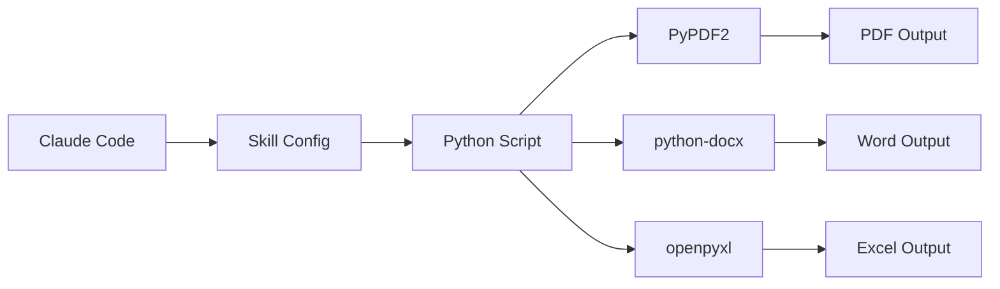

<div align="center">

# Frank's Claude Code Skills
> Claude Code 技能扩展集合 · Claude Code Skills Collection


扩展 Claude Code 能力的实用技能集合 · 文档处理 · 自动化工具

__简体中文__ | [English](./README_EN.md)

---
</div>

## 项目简介

**Frank's Claude Code Skills** 是一套专为 Claude Code 设计的技能扩展集合。这些技能可以让 Claude Code 执行特定的专业任务，如文档处理、文件操作、自动化工作流等。

每个技能都是独立模块，可按需安装和配置，让 Claude Code 变得更加强大和实用。

## 🌟 可用技能

### 1. 📄 Watermark - 文档水印工具

为 PDF、Word、Excel 文件批量添加水印。

**功能特点：**
- 📁 支持多种格式：PDF、DOCX、XLSX
- 🔄 批量处理：单文件或整个目录
- 🇨🇳 中文支持：完美显示中文水印
- 🔒 安全默认：不修改原文件（除非明确指定）
- ⚙️ 灵活输出：新文件、指定目录、覆盖原文件

**命令行使用：**

```bash
# 安装依赖
pip install PyPDF2 reportlab python-docx openpyxl

# 单文件处理（生成 file_watermarked.pdf，保留原文件）
python3 skills/watermark/watermark.py -t "机密文件" document.pdf

# 处理整个目录
python3 skills/watermark/watermark.py -t "内部使用" -d ./documents

# 输出到新目录
python3 skills/watermark/watermark.py -t "草稿" -d ./docs -o ./watermarked

# 覆盖原文件（谨慎使用）
python3 skills/watermark/watermark.py -t "机密" -d ./docs --overwrite
```

**Claude Code 中使用：**
```
为这个 PDF 文件添加"机密文件"水印
批量为 /documents 目录下的所有文件添加水印
```

**参数说明：**

| 参数 | 说明 |
|------|------|
| `-t, --text` | 水印文本（必填） |
| `-d, --directory` | 处理整个目录 |
| `-o, --output` | 输出目录 |
| `--overwrite` | 覆盖原文件 |

**输出行为：**

| 模式 | 命令 | 结果 |
|------|------|------|
| 默认 | `watermark.py -t "text" file.pdf` | 创建 `file_watermarked.pdf` |
| 指定目录 | `watermark.py -t "text" -d ./docs -o ./out` | 输出到 `./out/` |
| 覆盖 | `watermark.py -t "text" --overwrite file.pdf` | 修改原文件 |

**支持格式：**

| 格式 | 扩展名 | 处理库 |
|------|--------|--------|
| PDF | .pdf | PyPDF2, reportlab |
| Word | .docx | python-docx |
| Excel | .xlsx | openpyxl |

## 🛠️ 技术架构



### 技术栈

- **配置格式**：YAML (skill.yaml)
- **实现语言**：Python 3.8+
- **核心依赖**：
  - PyPDF2 - PDF 处理
  - reportlab - PDF 水印生成
  - python-docx - Word 文档处理
  - openpyxl - Excel 电子表格处理

## 📁 目录结构

```
franks-claude-code-skills/
├── README.md              # 项目文档
├── skills/                # 技能目录
│   └── watermark/         # 水印技能
│       ├── skill.yaml     # 技能配置（中文）
│       └── watermark.py   # Python 实现
└── .git/                  # Git 仓库
```

## 🚀 快速开始

### 方式一：克隆仓库

```bash
git clone https://github.com/frankfika/franks-claude-code-skills.git
```

### 方式二：下载单个技能

从 `skills/` 目录下载所需的技能文件夹。

### 安装依赖

```bash
pip install PyPDF2 reportlab python-docx openpyxl
```

## 🔧 自定义技能

创建新技能的步骤：

1. **创建技能目录**：
```bash
mkdir -p skills/my-skill
```

2. **创建配置文件** `skill.yaml`：
```yaml
name: my-skill
description: 技能描述
trigger:
  - 触发关键词1
  - 触发关键词2
```

3. **实现技能逻辑**：编写 Python 脚本处理具体任务

## 📝 开发指南

### 添加新技能

1. Fork 本仓库
2. 在 `skills/` 目录下创建新技能文件夹
3. 添加 `skill.yaml` 配置和实现脚本
4. 提交 Pull Request

### 代码规范

- 使用 Python 3.8+ 语法
- 添加类型注解
- 编写清晰的文档字符串
- 处理异常情况

## 🔗 相关项目

- [watermark-pwa](https://github.com/frankfika/watermark-pwa) - 支持 PWA 的浏览器端水印工具

## 🎯 使用场景

| 场景 | 技能 | 示例 |
|------|------|------|
| 文档保护 | Watermark | 添加"机密"水印 |
| 批量处理 | Watermark | 目录批量加水印 |
| 版权声明 | Watermark | 添加版权信息 |

## 🤝 贡献

欢迎贡献新技能或改进现有技能！

1. Fork 本仓库
2. 创建特性分支 (`git checkout -b feature/new-skill`)
3. 提交更改 (`git commit -m 'Add new skill'`)
4. 推送到分支 (`git push origin feature/new-skill`)
5. 创建 Pull Request

## 📄 许可证

MIT License - 详见 [LICENSE](./LICENSE)

## 🙏 致谢

- [Claude Code](https://claude.ai/) - Anthropic 的 AI 编程助手
- 所有开源库的维护者

---

<div align="center">

**让 Claude Code 更强大 🚀**

Copyright © 2024 Frank's Skills

</div>
