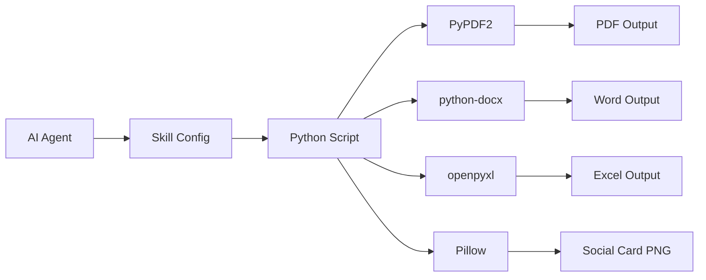

<div align="center">

# Agent Skills
> 可复用的 AI Agent 技能、脚本与工作流 · Reusable skills, scripts, and workflows for AI agents


把可复用的 AI 工作流沉淀成开源 skill · 文档处理 · 社交发布 · 自动化工具

---
</div>

## 项目简介

**Agent Skills** 是一套可复用的 AI Agent 技能库，用来沉淀日常工作中可以公开复用的流程、脚本和提示词。它不绑定某一个工具，可以被 Claude Code、Codex、Gemini CLI、Kimi、OpenClaw 等不同 Agent 环境参考或改造使用。

每个技能都是独立模块，可按需安装、复制和改造。适合公开的通用能力会放在这里；涉及账号、公司资料、客户数据、密钥或本地私有路径的流程不放入本仓库。

## 🌟 可用技能

### 1. 📄 Watermark - 文档水印工具

为 PDF、Word、Excel 文件批量添加水印。

**功能特点：**
- 📁 支持多种格式：PDF、DOCX、XLSX
- 🔄 批量处理：单文件或整个目录
- 🇨🇳 中文支持：完美显示中文水印
- 🔒 安全默认：不修改原文件（除非明确指定）
- ⚙️ 灵活输出：新文件、指定目录、覆盖原文件

**命令行使用：**

```bash
# 安装依赖
pip install PyPDF2 reportlab python-docx openpyxl

# 单文件处理（生成 file_watermarked.pdf，保留原文件）
python3 skills/watermark/watermark.py -t "机密文件" document.pdf

# 处理整个目录
python3 skills/watermark/watermark.py -t "内部使用" -d ./documents

# 输出到新目录
python3 skills/watermark/watermark.py -t "草稿" -d ./docs -o ./watermarked

# 覆盖原文件（谨慎使用）
python3 skills/watermark/watermark.py -t "机密" -d ./docs --overwrite
```

**Agent 中使用：**
```
为这个 PDF 文件添加"机密文件"水印
批量为 /documents 目录下的所有文件添加水印
```

**参数说明：**

| 参数 | 说明 |
|------|------|
| `-t, --text` | 水印文本（必填） |
| `-d, --directory` | 处理整个目录 |
| `-o, --output` | 输出目录 |
| `--overwrite` | 覆盖原文件 |

**输出行为：**

| 模式 | 命令 | 结果 |
|------|------|------|
| 默认 | `watermark.py -t "text" file.pdf` | 创建 `file_watermarked.pdf` |
| 指定目录 | `watermark.py -t "text" -d ./docs -o ./out` | 输出到 `./out/` |
| 覆盖 | `watermark.py -t "text" --overwrite file.pdf` | 修改原文件 |

**支持格式：**

| 格式 | 扩展名 | 处理库 |
|------|--------|--------|
| PDF | .pdf | PyPDF2, reportlab |
| Word | .docx | python-docx |
| Excel | .xlsx | openpyxl |

### 2. X Post Crafter - X/Twitter 推文与配图助手

把一句想法整理成更适合 X 信息流传播的推文，并生成清晰的 16:9 对比卡片。

**功能特点：**
- 推文优化：把口语想法改成短 hook、短段落、强观点
- 对比表达：适合工具体验、产品差异、观点拆解
- 配图生成：内置横版信息卡片脚本，避免小字渲染变形
- 发布检查：发布前检查正文重复、截断、图片预览和按钮状态
- 链接确认：发布后确认时间线新帖并返回链接

**命令行生成配图：**

```bash
python3 skills/x-post-crafter/x_post_card.py \
  --title "Codex vs Claude Code" \
  --tagline "不是替代，是分工" \
  --left-title "Codex" \
  --left "更像桌面级 AI 工程工作台" \
  --left "读仓库、改文件、跑测试" \
  --right-title "Claude Code" \
  --right "更像终端里的代码搭档" \
  --right "轻快、直接、命令感强" \
  --footer "以后不是选一个 AI，而是给不同工作流配不同搭档。" \
  --output ./codex-vs-claude-code.png
```

**Agent 中使用：**
```
帮我把这句话改成更利于传播的推文，并配图发到 X
写一下 Codex 和 Claude Code 的区别，做一张对比图
```

### 3. Expense Reimbursement - 报销材料整理助手

整理报销发票、凭证、行程单和订单截图，按费用组分类归档，并生成报销明细、汇总和统计表。

**功能特点：**
- 递归扫描：支持 PDF、JPG、PNG、WEBP、BMP
- 自动分类：打车票、火车飞机票、住宿费、餐费、其他
- 发票去重：根据发票号码、金额、商户、日期识别重复发票
- 凭证配对：把发票、订单、行程单放入同一费用组
- 报表生成：输出 `报销明细.csv`、`报销汇总.md`、`报销统计.xlsx`
- 可执行脚本：根据 manifest 落盘整理文件、生成报表并校验路径

**Agent 中使用：**
```
帮我整理这个文件夹里的报销发票，分类、去重，并生成报销汇总
把这些打车票和发票配对整理成报销明细
```

**命令行使用：**

```bash
pip install -r skills/expense-reimbursement/requirements.txt

python3 skills/expense-reimbursement/scripts/expense_reimbursement.py init ./expense-demo

# 填写 expense-demo/manifest_template.csv 后执行：
python3 skills/expense-reimbursement/scripts/expense_reimbursement.py organize \
  --manifest ./expense-demo/manifest_template.csv \
  --input-root ./expense-demo \
  --output-dir ./expense-demo/organized

python3 skills/expense-reimbursement/scripts/expense_reimbursement.py validate ./expense-demo/organized
```

## 🛠️ 技术架构



### 技术栈

- **配置格式**：YAML (skill.yaml)
- **实现语言**：Python 3.8+
- **核心依赖**：
  - PyPDF2 - PDF 处理
  - reportlab - PDF 水印生成
  - python-docx - Word 文档处理
  - openpyxl - Excel 电子表格处理
  - Pillow - 社交媒体配图生成

## 📁 目录结构

```
agent-skills/
├── README.md              # 项目文档
├── skills/                # 技能目录
│   ├── watermark/         # 水印技能
│   │   ├── skill.yaml     # 技能配置（中文）
│   │   └── watermark.py   # Python 实现
│   ├── x-post-crafter/    # X/Twitter 推文与配图技能
│   │   ├── skill.yaml     # 技能配置（中文）
│   │   └── x_post_card.py # 配图生成脚本
│   └── expense-reimbursement/ # 报销材料整理技能
│       ├── SKILL.md       # Codex/Claude 风格技能说明
│       ├── skill.yaml     # 技能配置（中文）
│       ├── requirements.txt
│       ├── scripts/
│       │   └── expense_reimbursement.py
│       ├── references/
│       │   └── manifest-schema.md
│       └── assets/
│           └── manifest_template.csv
└── .git/                  # Git 仓库
```

## 🚀 快速开始

### 方式一：克隆仓库

```bash
git clone https://github.com/frankfika/agent-skills.git
```

### 方式二：下载单个技能

从 `skills/` 目录下载所需的技能文件夹。

### 安装依赖

```bash
pip install PyPDF2 reportlab python-docx openpyxl Pillow
```

## 🔧 自定义技能

创建新技能的步骤：

1. **创建技能目录**：
```bash
mkdir -p skills/my-skill
```

2. **创建配置文件** `skill.yaml`：
```yaml
name: my-skill
description: 技能描述
trigger:
  - 触发关键词1
  - 触发关键词2
```

3. **实现技能逻辑**：编写 Python 脚本处理具体任务

## 🔓 开源原则

适合放进本仓库的 skill：

- 不包含账号、密钥、token 或 cookie
- 不包含公司、客户、投融资、财务、法务等敏感资料
- 不写死个人本地路径，或已用占位符替代
- 方法论和脚本具有通用复用价值
- 可以被他人复制后直接改造使用

不适合开源的内容请保留在私有仓库或本地目录。

## 📝 开发指南

### 添加新技能

1. Fork 本仓库
2. 在 `skills/` 目录下创建新技能文件夹
3. 添加 `skill.yaml` 配置和实现脚本
4. 提交 Pull Request

### 代码规范

- 使用 Python 3.8+ 语法
- 添加类型注解
- 编写清晰的文档字符串
- 处理异常情况

## 🔗 相关项目

- [watermark-pwa](https://github.com/frankfika/watermark-pwa) - 支持 PWA 的浏览器端水印工具

## 🎯 使用场景

| 场景 | 技能 | 示例 |
|------|------|------|
| 文档保护 | Watermark | 添加"机密"水印 |
| 批量处理 | Watermark | 目录批量加水印 |
| 版权声明 | Watermark | 添加版权信息 |
| 社交发布 | X Post Crafter | 优化推文并配图发布 |
| 产品对比 | X Post Crafter | 生成工具差异对比图 |
| 报销整理 | Expense Reimbursement | 分类发票并生成报销表 |
| 发票去重 | Expense Reimbursement | 识别重复发票并排除汇总 |

## 🤝 贡献

欢迎贡献新技能或改进现有技能！

1. Fork 本仓库
2. 创建特性分支 (`git checkout -b feature/new-skill`)
3. 提交更改 (`git commit -m 'Add new skill'`)
4. 推送到分支 (`git push origin feature/new-skill`)
5. 创建 Pull Request

## 📄 许可证

MIT License - 详见 [LICENSE](./LICENSE)

## 🙏 致谢

- [Claude Code](https://claude.ai/) - Anthropic 的 AI 编程助手
- [Codex](https://openai.com/codex/) - OpenAI 的 AI 编程助手
- 所有开源库的维护者

---

<div align="center">

**把好用的工作流沉淀成可复用的 skill 🚀**

Copyright © 2026 Agent Skills

</div>
